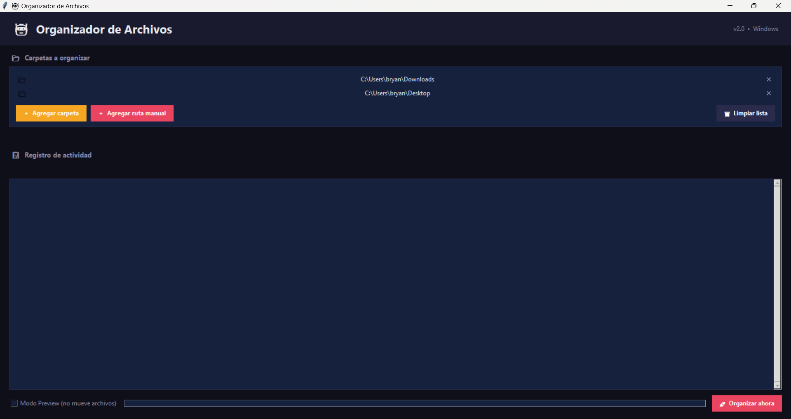

# 🗂️ Organizador de Archivos con Interfaz Gráfica

Aplicación desarrollada en Python que permite organizar archivos automáticamente mediante una interfaz gráfica fácil de usar.

## 🚀 Características

- Interfaz gráfica intuitiva
- Organización automática de archivos por tipo
- Compatible con usuarios sin conocimientos técnicos
- Versión ejecutable (.exe) lista para usar
- Clasificación por categorías (imágenes, documentos, videos, etc.)

## 🖥️ Interfaz

## 🛠️ Tecnologías utilizadas

- Python 3
- Tkinter (o la librería que hayas usado)
- PyInstaller (para generar el ejecutable)

## 📂 Estructura del proyecto
OrganizadorArchivos.exe <-- programa ejecutable
OrganizadorArchivos.py
README.md
imagenes/

## ▶️ Cómo usar (opción 1 - ejecutable)

1. Ejecutar `organizador.exe`
2. Seleccionar la carpeta a organizar
3. El programa hará el resto automáticamente

## ▶️ Cómo usar (opción 2 - código fuente)

1. Instalar Python 3
2. Ejecutar:

## 📦 Tipos de archivos organizados

📷 Fotos: ".jpg", ".jpeg", ".png", ".gif", ".bmp", ".tiff", ".webp", ".heic", ".raw"
🎬 Videos: ".mp4", ".avi", ".mkv", ".mov", ".wmv", ".flv", ".webm", ".m4v"
🎵 Música: ".mp3", ".wav", ".flac", ".aac", ".ogg", ".wma", ".m4a"
📄 Documentos: ".pdf", ".doc", ".docx", ".xls", ".xlsx", ".ppt", ".pptx", ".txt", ".rtf"
💻 Código: ".py", ".js", ".ts", ".html", ".css", ".java", ".cpp", ".json", ".xml", ".sql"
📦 Comprimidos: ".zip", ".rar", ".7z", ".tar", ".gz", ".iso"
🖋️ Diseño: ".psd", ".ai", ".svg", ".fig", ".sketch", ".eps"
⚙️ Ejecutables: ".exe", ".msi", ".apk"
📁 Otros: carpeta para guardar archivos no reconocidos por el programa

## ⚠️ Nota

El archivo ejecutable puede ser detectado como sospechoso por algunos antivirus debido a su compilación. Es seguro si se descarga desde este repositorio.